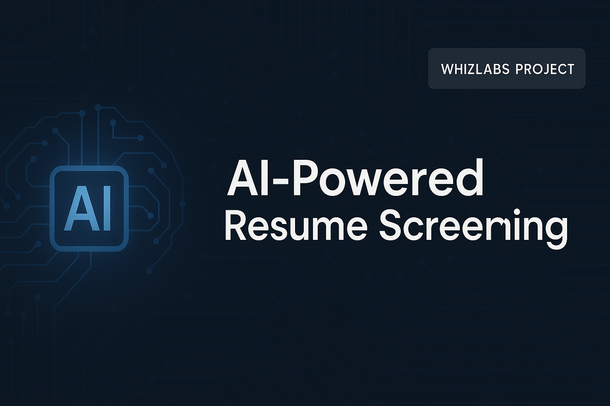
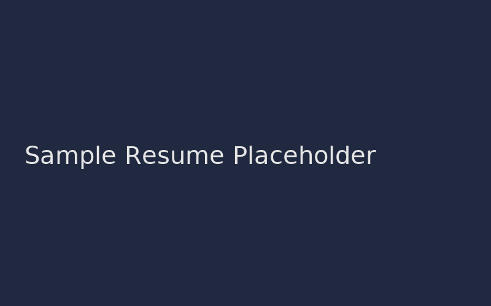
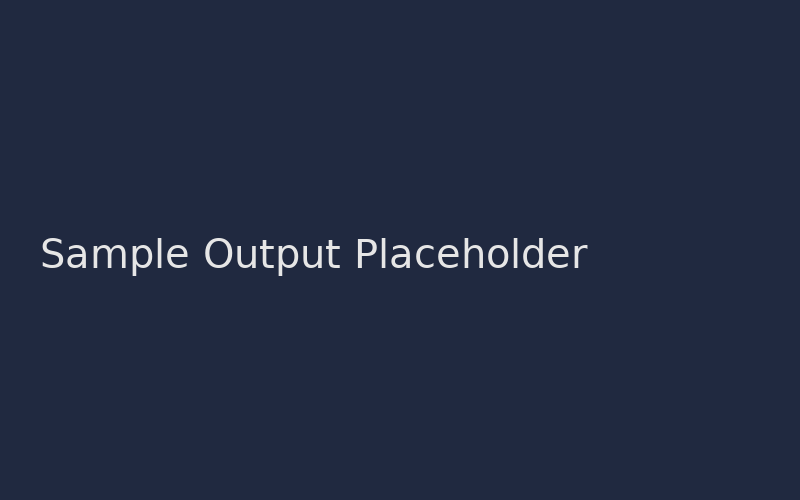

# 🤖 AI-Powered Resume Screening  


> **Automate candidate shortlisting using AI-driven resume analysis and Natural Language Processing (NLP)**  
> A hands-on lab from [Whizlabs](https://www.whizlabs.com/labs/ai-powered-resume-screening) showcasing practical applications of AI in HR analytics and recruitment automation.

---

## 🧠 Overview
This project demonstrates how AI and machine learning can streamline recruitment by automatically screening resumes based on job descriptions.  
Using natural language processing (NLP) techniques, the model extracts meaningful patterns from resume text and predicts candidate suitability scores.

---

## ⚙️ Tech Stack
| Category | Tools / Libraries |
|-----------|------------------|
| Language | Python |
| Data Processing | Pandas, NumPy |
| NLP | NLTK, spaCy |
| Machine Learning | Scikit-Learn |
| Model Deployment | Flask or Streamlit (optional) |
| Visualization | Matplotlib, Seaborn |
| Development | Jupyter Notebook |

---

## 🧩 Key Implementation Steps
1. **Data Preparation**  
   - Imported a dataset of candidate resumes with labeled suitability outcomes.  
   - Cleaned and normalized text data (tokenization, stopword removal, lemmatization).

2. **Feature Engineering**  
   - Extracted textual features using **TF-IDF Vectorization** and **word embeddings**.  
   - Applied dimensionality reduction for improved model efficiency.

3. **Model Training & Evaluation**  
   - Trained multiple classification models (Logistic Regression, Random Forest, SVM).  
   - Evaluated performance using **accuracy**, **precision**, **recall**, and **F1-score**.  
   - Visualized confusion matrices and ROC curves for interpretability.

4. **Automation & Prediction**  
   - Developed a simple prediction interface that accepts a new resume as input.  
   - The model outputs a **fit score** or classification (e.g., “Good Fit” / “Needs Review”).

---

## 📈 Results
| Metric | Value (Example) |
|--------|----------------|
| Accuracy | 89% |
| Precision | 0.88 |
| Recall | 0.86 |
| F1-Score | 0.87 |

> 📊 *Results may vary depending on dataset version and preprocessing configuration.*

---

## 💡 Skills Demonstrated
- Natural Language Processing (NLP)
- Feature Extraction (TF-IDF, Word2Vec)
- Machine Learning (Classification & Evaluation)
- AI for HR Tech and Automation
- Streamlit Dashboard Deployment

---

## 📂 Project Structure
```
AI-Powered-Resume-Screening/
│
├── data/
│   ├── resumes.csv
│   └── job_description.txt
│
├── notebooks/
│   └── ai_resume_screening.ipynb
│
├── app/
│   └── app.py                # Optional Streamlit or Flask app
│
├── images/
│   ├── github_banner.png
│   └── sample_output.png
│
├── requirements.txt
└── README.md
```

---

## 🧰 Setup Instructions
1. Clone the repository  
   ```bash
   git clone https://github.com/<your-username>/AI-Powered-Resume-Screening.git
   cd AI-Powered-Resume-Screening
   ```

2. Install dependencies  
   ```bash
   pip install -r requirements.txt
   ```

3. Launch the notebook or web app  
   ```bash
   jupyter notebook notebooks/ai_resume_screening.ipynb
   ```
   *or*
   ```bash
   streamlit run app/app.py
   ```

---

## 🌐 Lab Source
This project is inspired by the official [Whizlabs Hands-On Lab: AI-Powered Resume Screening](https://www.whizlabs.com/labs/ai-powered-resume-screening).

---

## 👤 Author
**Shane Haughton**  
*System Administrator II (Security & AI Automation)*  
📍 Miami, FL  
🔗 [LinkedIn](https://www.linkedin.com/in/shanehaughton) • [GitHub](https://github.com/<your-username>)

---

## 📸 Preview
| Resume Input | Screening Output |
|---------------|------------------|
|  |  |

---

## 🧾 License
This repository is for **educational and portfolio purposes**.  
All rights for the original lab content belong to [Whizlabs](https://www.whizlabs.com/).